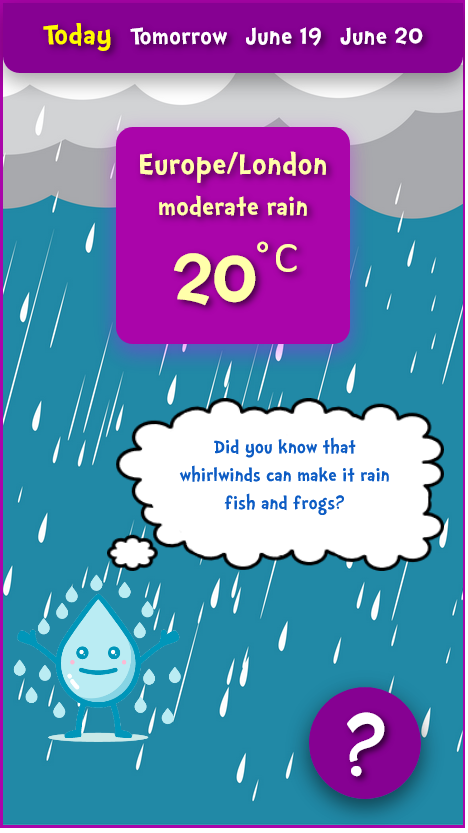
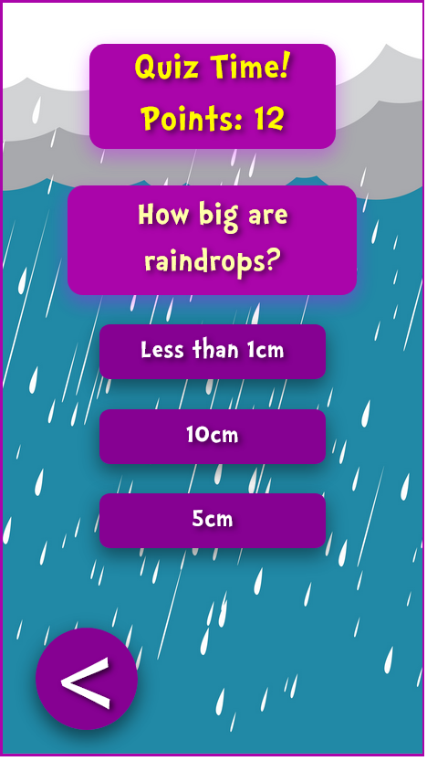

# Weather App for Kids

## About this project
This project was an assignment for the GUI module of my second year at university (2020/2021).

It was my first experience using React and uses the OpenWeather One Call API to retrieve current weather data.

It was graded 92/100.

## Screenshots

## Author

- Website - [https://ib-rim.github.io/](https://ib-rim.github.io/)